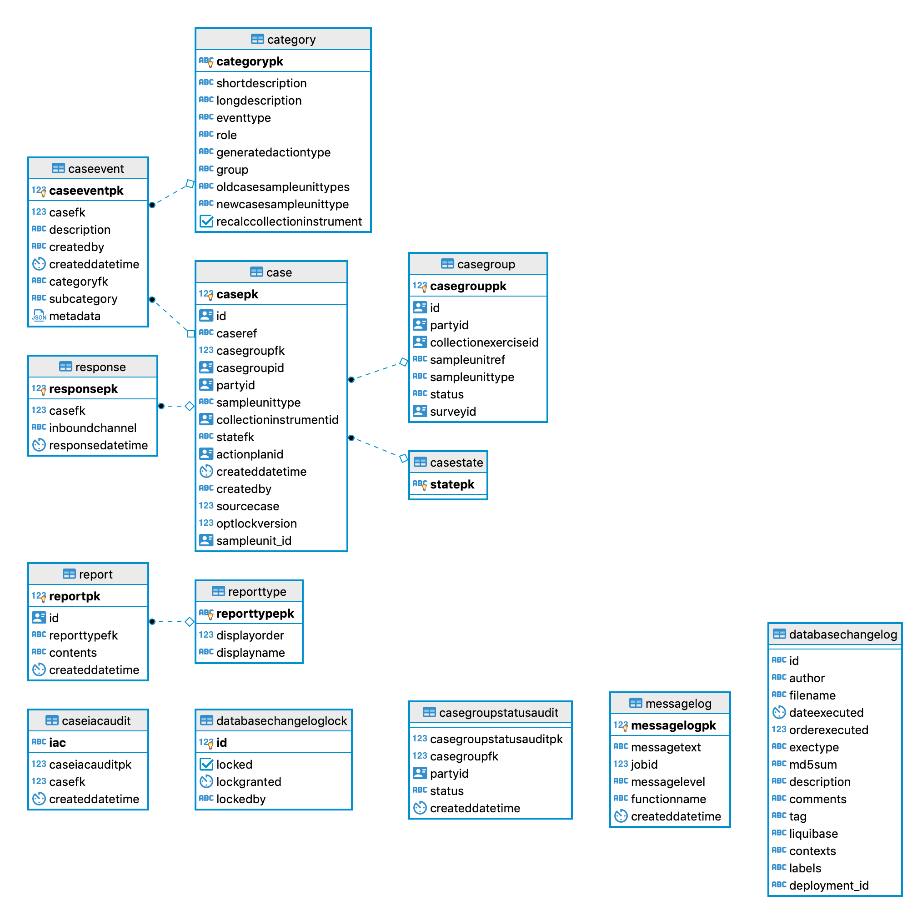

# Case Database

## Case Schema 

### Case
Cases represent an expected response from a sample unit (i.e. business). This table holds the 
details of that Case.

### Case Group
Case group represents a collection of related cases and is created from the sample unit parent. 

### Case State
Each case can have a state, this table holds those states. They are:
1. ACTIONABLE
1. INACTIONABLE
1. REPLACEMENT_INIT
1. SAMPLED_INIT

### Case Event
Records events that happen to a case, these can be things like respondents enrolling and generating
enrolment codes. Any enrolment changes will trigger new action plan.

### Categories
Each case event has a category, these categories are represent the type of event. For example, it could be
respondent enrolled, completed by phone, eq launched.

### Report
Populated by the two stored procedures "generate_case_events_report" and "generate_response_chasing_report". 
This table stores info about case events and response chasing but doesn't appear to be read from.

### Report type
A static table that contains two entries - CASE_EVENTS and RESPONSE_CHASING. These are used by the above
stored procedure.

### Message Log
A message log table written to by the stored procedures.

### Case Iac Audit
A mapping between a case and a generated IAC code. An entry is created in this table whenever an IAC code is 
generated.

### Database Changelog and Database Changelog Lock
Liquibase table

